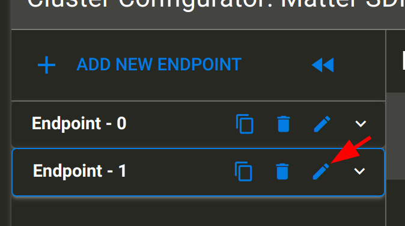
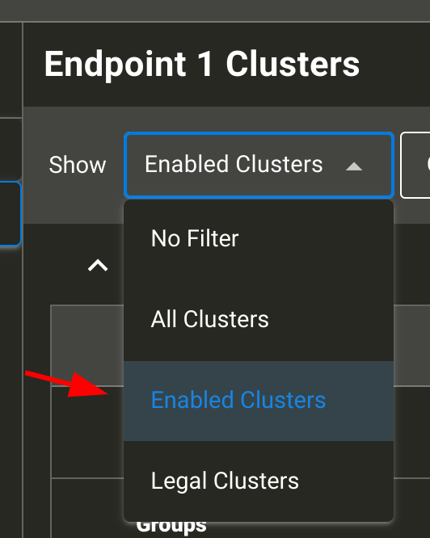

# CHEF devices

Device definitions reside in `examples/chef/devices` as .zap and .matter files.

Generally you need to follow these steps to use a new device:

-   Create a zap/matter configuration (forking an existing one is the easiest)
-   Rename to a final/stable name
-   Test

## Creating a new zap configuration

The easiest way to get started is using an existing configuration. A template
is provided in `./examples/chef/devices/template.zap`.

To open the zap GUI for this device, run:

```
./examples/chef/chef.py -g -d template
```

### Editing the zap configuration:

Using the ZAP UI, make the following changes:

-   Leave Endpoint 0 unchanged
-   Click the Edit/Pencil icon to change Endpoint 1 ()
    -   Update the device type to the new device and click "save" ()
    -   In the "Filter" section select "Enabled Clusters" and validate what
        clusters are set ()
        -   Ensure clusters for the device type are enabled (this is generally
            automatically the case)
        -   Click the gear icon on the cluster to further edit enabled
            attributes and commands
        -   You can add additional optional clusters if needed (disable filtering
            and use the search option)

Once all edits are done, click "File" => "Save as..." to save it under a **NEW**
name inside `examples/chef/devices/`.

NOTE: make sure you save under `examples/chef/devices` since internal paths
inside the saved file will be relative to the save location (it cannot simply be
moved later without manual editing).

It is suggested to name this `rootnode_<device_type_name>.zap` (e.g.,
rootnode_smokecoalarm.zap for Matter Smoke CO Alarm device type)

## Establishing a "final name"

General naming convention for chef is `<ep0>_<ep1>_<hash>` where `<epN>` is the
type of endpoint (and `<ep0>` is almost always `rootnode`).

The hash is a one-time uniquely generated identifier to allow separate
configurations for the same devices (e.g different features enabled).

You can read more in `examples/chef/sample_app_util/README.md`, however the
short version is that you can determine a recommended name using:

```
./examples/chef/sample_app_util/sample_app_util.py zap --generate-name <saved_zap_file_name>
```

and generally you want to just rename it via:

```
./examples/chef/sample_app_util/sample_app_util.py zap --rename-file <saved_zap_file_name>
```

## Running code generation (to generate .matter file)

To generate the matter file for your target, run

```
./scripts/tools/zap/generate.py <new_device_zap_name>
```

This should generate the corresponding `.matter` file for the zap file you
created.

## Testing

Basic device availability should show when running:

```
./examples/chef/chef.py -h | less
```

### Compilation

This example uses `rootnode_contactsensor_lFAGG1bfRO` for commands. Substitute
your own device for testing newly created devices.

```
./examples/chef/chef.py                 \
   -t linux                             \
   -d rootnode_contactsensor_lFAGG1bfRO \
   -b
```

Where options used are:

-   `-t` specifies the target platform
-   `-d` specifies the device to build
-   `-b` asks for build to be run

### Execution

Build will be available in
`examples/chef/linux/out/rootnode_contactsensor_lFAGG1bfRO` (path will vary
based on platform and device being built)
